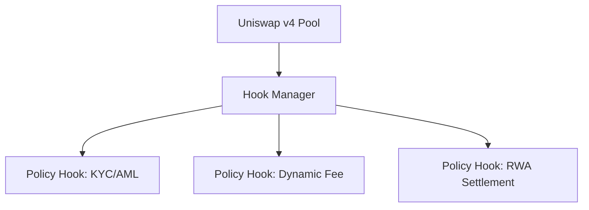

# 🧠 Uniswap v4 Hook-Based On-Chain Policy Orchestration Architecture

**A modular architecture for secure, composable, and policy-enforced Uniswap v4 pools**

---

## 📌 Overview

Uniswap Protocol v4 introduces powerful flexibility through hooks—but with that power comes complexity. This repository introduces a proposed architecture to manage and standardize that complexity: the **Hook Manager Framework**.

This system enables pools to enforce **compliance rules**, **pricing logic**, **risk controls**, and **real-world asset (RWA) settlement logic**—all **on-chain, modular, and composable**, without altering the Uniswap v4 core protocol.

---

## 🧩 Key Components

### 🔹 Hook Manager (Policy Orchestrator)
- Orchestrates execution of multiple **policy-specific hook contracts**
- Executes **before/after** core pool operations (e.g., swaps, liquidity add/remove)
- Manages registration, deregistration, and execution order of policy logic
- Implements standardized **event emissions**, **pausability**, and **upgradability**

### 🔸 Policy-Specific Hook Contracts
- Single-purpose modules for:
  - KYC/AML enforcement
  - Dynamic fees
  - RWA settlement
  - MEV protection
  - Custom slippage or size limits
- Must implement a standard interface for compatibility
- Can be upgraded independently while preserving pool state

---

## 🎯 Why This Matters

| Benefit                | Description                                                                 |
|------------------------|-----------------------------------------------------------------------------|
| **Security**           | Modular contracts reduce audit complexity and isolate risks                |
| **Compliance**         | Enables on-chain KYC/AML, trade restrictions, and jurisdictional policies   |
| **Institutional Fit**  | Provides verifiable, transparent enforcement logic critical for adoption     |
| **Efficiency**         | Developers reuse standardized modules and interfaces                        |
| **Governability**      | Integrates scoped governance using UNI tokens for upgrades and curation     |
| **Monetization Ready** | Supports licensing, fee-sharing, and registry-based curation                |

---

## ⚙️ Architecture Summary

- Each pool is attached to a single Hook Manager
- The Hook Manager delegates calls to up to 5 modular pre-action and 5 modular post-action policy hooks per action
- Execution order is deterministic and auditable
- Hooks execute atomically as part of the pool transaction

---

## 📉 Trade-Offs & Design Considerations

### 💰 Gas Overhead
- Each policy hook adds gas (approx. 20–60K per hook)
- Acceptable for institutional or RWA transactions
- Mitigated by L2 deployment and selective policy application

### 🌊 Liquidity Fragmentation
- Policy-specific pools inherently segment liquidity
- Aggregators, smart routers, and incentives help unify UX
- For target users (institutions, DAOs, RWAs), **policy guarantees > slippage**

---

## 🔐 Governance & Ecosystem Model

### Scoped, Tiered Governance
- UNI token used for voting on hook upgrades, pausing, and governance parameters
- Tiered influence: Hook devs, LPs, DAOs, institutions vote by domain relevance
- Emergency recovery and rollback features are built-in

### Open Developer Roles
- **Hook Developers**: Build and publish policy-specific contracts
- **Curators**: Maintain registries of audited hooks for specific markets/verticals

---

## 💵 Licensing & Monetization (Illustrative)

| Partner Class     | Annual Fee     | Features                                           |
|-------------------|----------------|----------------------------------------------------|
| Startup / DAO     | $10,000 flat   | Standard policy suite, 1–2 pool support            |
| Mid-Tier Custodian| $50,000        | Governance input, hook config support              |
| Enterprise / Bank | $100K+ custom  | SLAs, onboarding, audit support, deployment tooling|

- **Hook licensing** available per-contract ($5K–$15K)
- **Shared deployment fees** enable cost-effective standardization
- Optional **registry subscription** for audits, priority inclusion, versioning

---

## 🧱 Example Use Cases

- 🇺🇸  Region-specific KYC/AML enforcement pools
- 🏦 Institutional pools with immutable risk parameters
- 🏨 RWA platforms with escrow, dynamic pricing, or rating hooks
- 📉 DAO-managed volatility-throttling liquidity pools

---

## 🤝 Ecosystem Synergies

- **DeFi Aggregators**: Integrate policy-compliant pools into smart routing
- **MEV Protection**: Hooks can coordinate with relayer strategies
- **Cross-Chain Compliance**: Hooks enforce policies even across bridge-based trades

---

## 📚 Full Whitepaper

> 📄 [Uniswap Protocol v4 Hook-Based On-Chain Policy Orchestration Architecture (PDF)](https://github.com/mohamedelbendary/uniswapv4policyorchestration/blob/main/Uniswap%20Protocol%20V4%20Hook-based%20On-Chain%20Policy%20Orchestration%20Architecture.pdf)

Includes detailed:
- Security analysis & attack vector mitigations
- Governance design
- Gas baseline estimation
- Scalability modeling
- Licensing frameworks

---

## 📬 Contact

**Author**: [Mohamed ElBendary](https://x.com/meprosterk)

**Inquiries**: Please use Issues or open a Discussion to provide input.

---

## 📝 License

This framework is shared under CC0 1.0 Public Domain Dedication. Attribution is appreciated.

---
